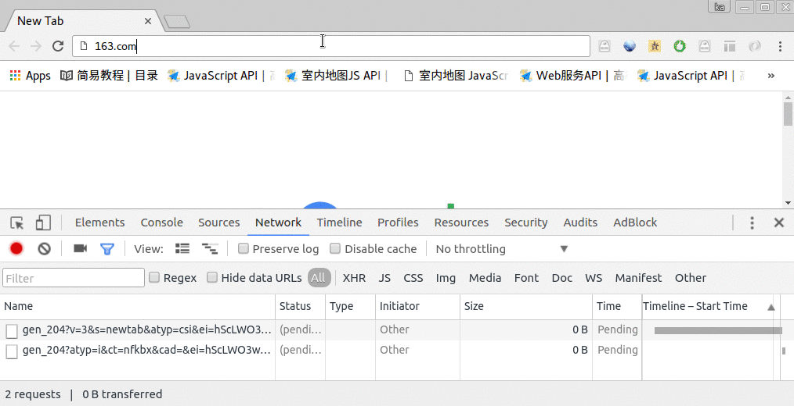

# assets pipeline

所有的 js, css, image, 都叫 assets.

## 爲啥用它.

傳統給頁面增加 js，css的方式, 是一堆CSS羅列上去：

```
<link rel="stylesheet" href="./static/buttons.css">
<link rel="stylesheet" href="./static/normalize.css">
<link rel="stylesheet" href="./static/font-awesome/css/font-awesome.css">
<script src="./static/javascript/jquery.min.js"></script>
<script src="./static/javascript/jqueryui.min.js"></script>
<script src="./static/javascript/bootstrap.min.js"></script>
```

以上內容，會在頁面打開時增加負擔： 多加載N個http request( 上面是 3個css, 3個js )。

一般的項目， 往往會用到 上百個 js.css.

(例如： http://sina.com.cn). 每次請求，至少要發出500+ 個請求，

其中 js 請求 161個， CSS 2 個（這個還可以）)

再比如， 163.com  , 總共 400+ 請求， 8個 css，  121個 js 請求）

見下面的gif:



所以，優化HTML頁面的核心：減少 http請求。

我們的web開發中, 最耗費時間的不是請求數據庫，而是 瀏覽器端跟 服務器 建立連接的過程。

## 傳統，如何減少js/ css 的請求？

多個同類型的文件，可以合併。

下面兩個文件，
`buttons.css`:

```
.green_button: {   color:  'green' }
.red_button: {   color:  'red' }
.yellow_button: {   color:  'yellow' }
```

`normalize.css`:

```
p { color: black  }
div { border:  0px; margin: 0px }
```

就可以合併成一個大文件：


```
.green_button: {   color:  'green' }
.red_button: {   color:  'red' }
.yellow_button: {   color:  'yellow' }
p { color: black  }
div { border:  0px; margin: 0px }
```

就是很簡單的合併到一起，有衝突也沒關係。 哪個出現在下方，哪個就生效麼。

javascript也是一樣的。

## Rails中，是如何給多個js/css合併到一起的？

### 對於js文件：使用 application.js

全名：`app/assets/javascripts/application.js`

原來的代碼：

```
<script src="./static/javascript/jquery.min.js"></script>
<script src="./static/javascript/jqueryui.min.js"></script>
<script src="./static/javascript/bootstrap.min.js"></script>
```

我在rails當中，往往把所有的js文件，都放到 `app/assets/javascripts` 目錄下。

然後, 在對應的erb頁面中：
```
<%= javascript_include_tag 'jquery.min.js' %>
<%= javascript_include_tag 'jqueryui.min.js' %>
<%= javascript_include_tag 'bootstrap.min.js' %>
```

在Rails 3.0以後， Rails提供了新的功能: `assets pipeline`, 我們就把上面的代碼，統一寫到
`app/assets/javascripts/application.js` 中：

```

//= require jquery.min.js
//= require jqueryui.min.js
//= require bootstrap.min.js
```

注意： `//= require <文件名>`這個格式是固定的。 多個空格都不行！

然後，在佈局文件`app/views/layouts/application.html.erb`中， 引用它：


```

<html>
<head>
  <%= javascript_include_tag 'application' %>
</head>
  ...
</html>

```

上面代碼,在 "開發模式"下,就可以正確顯示出我們引用的javascript

### 對於 css 的合併

把

```
<link rel="stylesheet" href="./static/buttons.css">
<link rel="stylesheet" href="./static/normalize.css">
<link rel="stylesheet" href="./static/font-awesome/css/font-awesome.css">
```

中的 css文件，保存到 `app/assets/stylesheets`目錄下。

新增一個總體的 css文件： `app/assets/stylesheets/application.css`

內容如下

```
/*
 *= require buttons.css
 *= require normalize.css
 *= require font-awesome.css
 */
```

注意： 上面的 `*= require 文件名`的格式是固定的。多個空格都不行。

然後，在 佈局文件 `app/views/layouts/application.html.erb`中， 引用它：


```
<html>
<head>
  <%= stylesheet_link_tag 'application' %> </head>
  ...
</html>

```

## 如何壓縮css/js ？需要一個命令


```
$ bundle exec rake assets:precompile RAILS_ENV=production
```

- `rake assets:precompile`: 壓縮所有的css, js, 以及爲圖片增加後綴。(方便服務器緩存)
- `RAILS_ENV=production`: 指定你的環境

這個命令還會耗時大約幾分鐘。 根據你的CSS/JS文件的數量， 時間上有所不同。

壓縮完之後，就會發現， `public/assets` 目錄下，多出來兩個文件，形如：

```
application-308d70d0bd03d91770479da196ec0827.css
application-308d70d0bd03d91770479da196ec0827.js
```

這兩個文件, 就是把所有的js, css壓縮到一起的文件了. 以後, 我們每次打開WEB頁面時, 只發起這
兩個請求就夠了

開發模式下，我們的頁面加載，需要很多個 js， css 文件：
```
<link href="/assets/bootstrap.min.css?body=1" media="all" rel="stylesheet" />
<link href="/assets/customized_bootstrap.css?body=1" media="all" rel="stylesheet" />
<link href="/assets/jquery.ui.core.css?body=1" media="all" rel="stylesheet" />
<link href="/assets/jquery.ui.theme.css?body=1" media="all" rel="stylesheet" />
<link href="/assets/jquery.ui.accordion.css?body=1" media="all" rel="stylesheet" />
<link href="/assets/select2.min.css?body=1" media="all" rel="stylesheet" />
...
<script src="/assets/jquery.js?body=1"></script>
<script src="/assets/jquery_ujs.js?body=1"></script>
<script src="/assets/jquery.ui.core.js?body=1"></script>
<script src="/assets/jquery.ui.widget.js?body=1"></script>
<script src="/assets/jquery.ui.accordion.js?body=1"></script>
<script src="/assets/jquery.ui.position.js?body=1"></script>
<script src="/assets/jquery.ui.menu.js?body=1"></script>
```

在生產模式下，

```
<link href="/assets/application-ee1cf5e49ea54cc7b4cf3bef3be67d0c.css" media="all" rel="stylesheet" />
<script src="/assets/application-d45534ab0cd8c659530e2bebd7e60fbe.js"></script>
```


## rake assets:precompile 需要在什麼時候運行？

1. 不需要每次部署都運行。
2. 只在 production 環境下，才需要運行。
3. 只在修改了css/js文件後，才需要運行。


## asset_path 與 public 目錄

Rails 2.x的時代， 在 asset pipeline的概念出來之前，所有的圖片，js，css 都放到`public` 目錄下。

Rails 3.1 以後（2011年），出現了 `asset_pipeline` , 那麼所有的需要進行 js，css壓縮
的內容， 都要放到`app/asset`

所有的 `app/assets` 目錄下的東西，都可以被編譯。（ `32.jpg` -> `32_a1b2c3d4...z100.jpg`)

通過頁面中,加入這個,就可以看到:
```
<%= asset_path '2.png' %>
```

所有的 public 目錄下的東西，都可以在開發模式下，被rails服務器所訪問。
例如：

`public/images/1.jpg`

在頁面index.html.erb中,就可以訪問到:

```

```

## 爲什麼不鼓勵，把erb中使用的圖片，放到`public` 目錄下？

部署時，幾乎所有的 `/images`,  `/assets`, 都會被nginx做解析。
nginx中的解析，會跟rails中直接引用 `images/1.jpg` 有一些衝突。

所以，在目前看來， asset pipeline 極度流行， 那麼大家不要把erb（css）中
用到的圖片，放到 `public` 目錄下。

而且在rails 服務器的生產環境下,配置讓rails 服務器來解析對於assets的請求,很麻煩.

## 一個例外

上傳的文件，都保存到 public 目錄。

