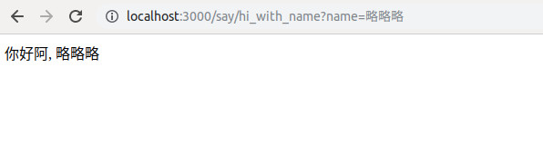
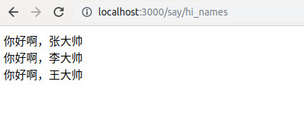

# 最简单的rails 入门过程

我们创建一个新的页面，并显示：

## 修改路由

修改`config/routes.rb`：

```ruby
Rails.application.routes.draw do
  get 'say/hi' => 'say#hi'
end
```

这里表示： 对于所有 `/say/hi` 的请求，都使用 `says_controller.rb` 中的`hi` action来处理。

## 修改controller

创建`app/controllers/say_controller.rb`, 内容如下：

```ruby
class SayController < ApplicationController
  def hi
  end
end
```

## 创建对应的view

创建`app/views/say/hi.html.erb`, 内容如下：

```ruby
你好啊，这是我的Rails第一个页面
```

## 读取页面传入的参数

修改`app/controllers/say_controller.rb`, 增加一个新的action

```ruby
class SayController < ApplicationController
  # 增加这个action
  def hi_with_name

    # params[:name] 用来从 request中读取参数name,  params是Rails的内置方法
    # @name 可以在该action对应的erb文件中直接使用
    @name = params[:name]
  end
end
```

增加路由, 修改`config/routes.rb`, 增加下面内容:

```ruby
get 'say/hi_with_name' => 'say#hi_with_name'
```

增加`app/views/say/hi_with_name.html.erb`, 内容如下：

```ruby
你好阿, <%= @name %>
```

上面的代码中，

- `<%= %>`是专门用来执行ruby代码的区域。
- `<%= @name %>` 是显示@name 这个变量

然后，我们访问 `http://localhost:3000/say/hi_with_name?name=略略略



## 循环显示数组

继续增加一个新的action, 在`app/controllers/say_controller` 中， 增加:

```ruby
class SayController < ApplicationController

  # 增加这个action
  def hi_names
  end

end
```

然后，在路由`config/routes.rb`中，增加：

```ruby
Rails.application.routes.draw do
  # 增加这个路由
  get 'say/hi_names' => 'say#hi_names'
end
```

增加视图文件：`app/views/say/hi_names.html.erb`

```ruby
<% ['张大帅', '李大帅', '王大帅'].each do |name| %>
  你好啊，<%= name %>
  <br/>
<% end %>
```

在上面的代码中，

- `<% %>` 是仅仅执行ruby代码
- `<% ['张大帅', '李大帅', '王大帅'].each do ... end %>` 是一段ruby代码,用于循环

访问 http://localhost:3000/say/hi_names 就可以看到：



## 不用学的。

其他的没讲到的，都不用学。 例如：

- render 'filename'
- render xxx,  :collection ...
- render xxx,  :as ...
- render xxx,  :object ...


# 作业

1.创建一个rails项目. 例如:  market

2.把该项目在本地运行起来  http://localhost:3000

3.这个项目中, 可以访问这个路径  http://localhost:3000/fruits/list

打开后, 页面应该显示下面三行内容:

```
香蕉
苹果
橘子
```

3.上传你的个人github空间
