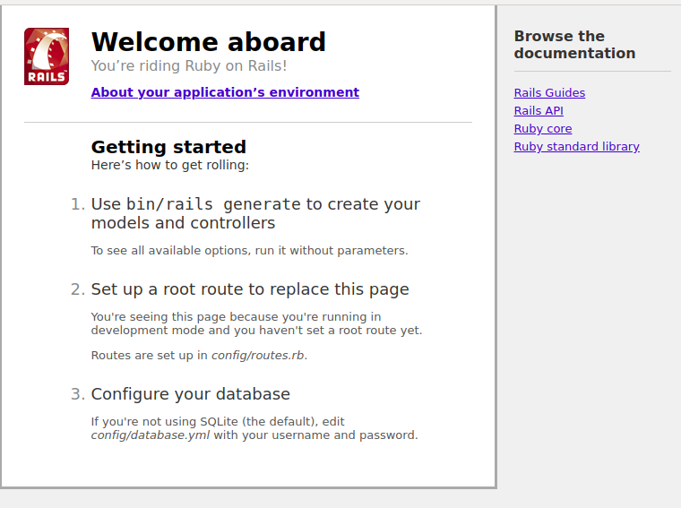

# 安裝與運行

## 版本說明

操作系統：Linux/Mac

注意：可以明確的是Windows暫不支持Rails.最大的阻礙是windows的環境由於被限制，無法正確安裝sqlite3或者mysql的依賴，導致無法安裝相應的gem,
直接導致Rails無法被安裝或者運行。

使用windows的同學，建議安裝雙系統，或者安裝虛擬機，然後在虛擬機上安裝Ubuntu 16.

- ruby 2.5.0.     這裏版本不限，我個人用2.5比較多。
- bundler 1.17.3
- rails 4.2.10
- mysql 5.x

對於Rails來說：

- Rails 2 是個穩定版本，
- Rails 3 增加了bundler, asset pipeline,
- Rails 4 增加了一系列優化
- Rails 5 支持了ActionCabel(用於聊天室等）
- Rails 6 增加了多數據庫的支持

考慮到入門的簡單和安裝的方便，我們直接採用Rails 4.2.10, 因爲Rails4 可以平滑過渡到Rails6.

MySQL: 5.x都可以。在Ubuntu 20上默認會安裝mysql 8. 都是一樣的。

## 安裝Rails

1. 在ubuntu上需要先安裝一系列的依賴

```
$ sudo apt-get update
$ sudo apt-get install libapr1-dev libxml2-dev  libxslt-dev mysql-server  \
  libmysqlclient-dev  git curl build-essential libssl-dev libreadline-dev  \
  build-essential libssl-dev libreadline-dev vim libcurl3 ruby-dev zlib1g-dev \
  liblzma-dev ruby-all-dev
```

2.安裝rbenv, ruby 3.0

過程略

3.安裝bundler

使用了ruby-china的鏡像站點, 可以大幅提高速度：

```
$ gem install bundler -v 1.17.3 --source https://gems.ruby-china.com

Successfully installed bundler-1.17.3
Parsing documentation for bundler-1.17.3
Parsing sources...
Installing ri documentation for bundler-1.17.3
Done installing documentation for bundler after 3 seconds
1 gem installed
```

4.安裝rails

```
$ gem install rails -v 4.2.10 --source https://gems.ruby-china.com
....
Installing ri documentation for rails-4.2.10
Done installing documentation for bundler ...
23 gems installed
```

注意： 如果你安裝了其他的rails版本，就把它們刪掉。

就可以了。

## 首次運行Rails

首先我們創建一個文件夾，專門用於學習Rails:

```
$ rails new lesson_one_quick_start
```

然後，我們會看到一系列的輸出：

```
create
create  README.rdoc
create  Rakefile
create  config.ru
create  .gitignore
create  Gemfile
create  app
create  app/assets/javascripts/application.js
create  app/assets/stylesheets/application.css
create  app/controllers/application_controller.rb
create  app/helpers/application_helper.rb
create  app/views/layouts/application.html.erb
create  app/assets/images/.keep
create  app/mailers/.keep
create  app/models/.keep
create  app/controllers/concerns/.keep
create  app/models/concerns/.keep
create  bin
create  bin/bundle
create  bin/rails
create  bin/rake
create  bin/setup
create  config
create  config/routes.rb
create  config/application.rb
create  config/environment.rb
create  config/secrets.yml
create  config/environments
create  config/environments/development.rb
create  config/environments/production.rb
create  config/environments/test.rb
create  config/initializers
create  config/initializers/assets.rb
create  config/initializers/backtrace_silencers.rb
create  config/initializers/cookies_serializer.rb
create  config/initializers/filter_parameter_logging.rb
create  config/initializers/inflections.rb
create  config/initializers/mime_types.rb
create  config/initializers/session_store.rb
create  config/initializers/to_time_preserves_timezone.rb
create  config/initializers/wrap_parameters.rb
create  config/locales
create  config/locales/en.yml
create  config/boot.rb
create  config/database.yml
create  db
create  db/seeds.rb
create  lib
create  lib/tasks
create  lib/tasks/.keep
create  lib/assets
create  lib/assets/.keep
create  log
create  log/.keep
create  public
create  public/404.html
create  public/422.html
create  public/500.html
create  public/favicon.ico
create  public/robots.txt
create  test/fixtures
create  test/fixtures/.keep
create  test/controllers
create  test/controllers/.keep
create  test/mailers
create  test/mailers/.keep
create  test/models
create  test/models/.keep
create  test/helpers
create  test/helpers/.keep
create  test/integration
create  test/integration/.keep
create  test/test_helper.rb
create  tmp/cache
create  tmp/cache/assets
create  vendor/assets/javascripts
create  vendor/assets/javascripts/.keep
create  vendor/assets/stylesheets
create  vendor/assets/stylesheets/.keep
   run  bundle install
```

上面這些輸出會在3～5秒內完成。表示的是創建了若干文件和文件夾。

最後光標往往會停留在 最後一行不動( `run bundle install` ), 這是由於進程被卡住了導致的，我們直接按`ctrl + c`來終止。


進入到剛纔創建的目錄下:

```
$ cd lesson_one_quick_start
```

## 文件夾結構

查看一下文件: (我在右側做了文件夾的說明）

```
total 68
drwxr-xr-x 12 siwei siwei 4096 1月  29 07:51 ./         當前路徑
drwxr-xr-x  3 siwei siwei 4096 1月  29 07:51 ../        上一級路徑
drwxr-xr-x  8 siwei siwei 4096 1月  29 07:51 app/       最重要的目錄
drwxr-xr-x  2 siwei siwei 4096 1月  29 07:51 bin/       自動生成的，不要修改
drwxr-xr-x  5 siwei siwei 4096 1月  29 07:51 config/    配置文件目錄，很重要
-rw-r--r--  1 siwei siwei  153 1月  29 07:51 config.ru  自動生成的，不要修改
drwxr-xr-x  2 siwei siwei 4096 1月  29 07:51 db/        存放數據庫相關的文件
-rw-r--r--  1 siwei siwei 1503 1月  29 07:51 Gemfile    bundler使用
-rw-r--r--  1 siwei siwei  474 1月  29 07:51 .gitignore git使用
drwxr-xr-x  4 siwei siwei 4096 1月  29 07:51 lib/       暫時用不到
drwxr-xr-x  2 siwei siwei 4096 1月  29 07:51 log/       日誌文件夾，調試重要
drwxr-xr-x  2 siwei siwei 4096 1月  29 07:51 public/    用於存放圖片等文件夾
-rw-r--r--  1 siwei siwei  249 1月  29 07:51 Rakefile   自動生成的，不要修改
-rw-r--r--  1 siwei siwei  478 1月  29 07:51 README.rdoc 項目說明文件, 要修改
drwxr-xr-x  8 siwei siwei 4096 1月  29 07:51 test/      測試文件夾，可以刪掉
drwxr-xr-x  3 siwei siwei 4096 1月  29 07:51 tmp/       自動生成的，不要修改
drwxr-xr-x  3 siwei siwei 4096 1月  29 07:51 vendor/    基本沒用，可以刪掉
```

## 使用Gemfile安裝各種依賴的gem

我們修改一下Gemfile 文件，把下面內容粘貼上去：

```
source 'https://gems.ruby-china.com'

gem 'rails', '4.2.10'
gem 'mysql2', '0.3.21'
gem 'therubyracer', '0.12.3', platforms: :ruby
gem 'turbolinks', '5.2.1'

gem 'jquery-rails', '4.4.0'

```

然後運行：

```
$ bundle install
```

輸出結果如下：
```
Using rake 13.0.3
Using concurrent-ruby 1.1.8
Using i18n 0.9.5
....省略若干...
Using sprockets-rails 3.2.2
Using rails 4.2.10
Using ref 2.0.0
Using therubyracer 0.12.3
Using turbolinks-source 5.2.0
Using turbolinks 5.2.1
Bundle complete! 5 Gemfile dependencies, 42 gems now installed.
Use `bundle info [gemname]` to see where a bundled gem is installed.
```

就說明項目所需要的gems 都安裝好了。

## 配置數據庫

然後修改 `config/database.yml` 文件，這是數據庫的配置，我們把下面內容粘貼上去, 表示使用 `study_rails` 作爲數據庫,
地址是 localhost, 用戶名root, 密碼666666(可以根據你的本機MYSQL配置做修改)：

```
default: &default
  adapter: mysql2
  encoding: utf8
  collation: utf8_general_ci
  pool: 5
  host: localhost
  username: root
  password: 666666

development:
  <<: *default
  database: study_rails

test:
  <<: *default
  database: study_rails_test

production:
  database: study_rails
```

並且登錄本機Mysql, 創建對應的 `study_rails` 數據庫

```
mysql> CREATE DATABASE `study_rails` CHARACTER SET utf8 COLLATE utf8_general_ci;

Query OK, 1 row affected (0.01 sec)
```

然後運行

```
$ bundle exec rails s

=> Booting WEBrick
=> Rails 4.2.10 application starting in development on http://localhost:3000
=> Run `rails server -h` for more startup options
=> Ctrl-C to shutdown server
[2021-01-29 09:02:42] INFO  WEBrick 1.4.2
[2021-01-29 09:02:42] INFO  ruby 2.6.4 (2019-08-28) [x86_64-linux]
[2021-01-29 09:02:42] INFO  WEBrick::HTTPServer#start: pid=32543 port=3000

```

使用瀏覽器打開： `http://localhost:3000`

就可以發現Rails已經成功運行了




## 關閉無用的警告

修改`config/environments/development.rb`, 把下面的內容設置成 `false`,

```
config.assets.check_precompiled_asset = false
```
