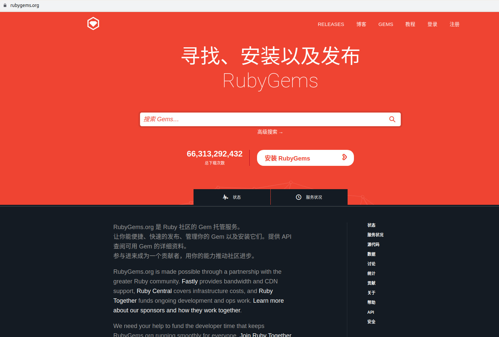

# Rubygem

rubygem 简称gem, 是Ruby的重要组成部分. 一个gem 就是一个ruby的组件。

在ruby中，一个gem对应是一个文件夹，默认是安装在某个文件夹中，例如

```
/home/siwei/.rbenv/versions/2.6.4/lib/ruby/gems/2.6.0
```

rubygem的思想是：把所有用到的gem都统一放在网络上，使用gem命令就可以自动下载，免去了手动安装依赖的麻烦。

rubygems.org如图：



## gem的使用

以下例子都以 `rails`作为gem的名字。

安装gem包

```bash
$ gem install rails
```

卸载gem包

```bash
$ gem uninstall rails
```

列出本地已安装的gem包
```bash
$ gem list --local rails
```

列出远程的gem包

```bash
$ gem list --remote rails
```

查询带有某个关键字的gem包

```bash
$ gem list -r keyword
```

获取gem帮助命令

```bash
$ gem help
```

获取一些gem的事例命令

```bash
$ gem help example
```

查看gem 在本机的安装路径：

```
$ gem env

```

结果如：

```
RubyGems Environment:
  - RUBYGEMS VERSION: 3.0.3
  - RUBY VERSION: 2.6.4 (2019-08-28 patchlevel 104) [x86_64-linux]
  - INSTALLATION DIRECTORY: /home/siwei/.rbenv/versions/2.6.4/lib/ruby/gems/2.6.0
  - USER INSTALLATION DIRECTORY: /home/siwei/.gem/ruby/2.6.0
  - RUBY EXECUTABLE: /home/siwei/.rbenv/versions/2.6.4/bin/ruby
  - GIT EXECUTABLE: /usr/bin/git
  - EXECUTABLE DIRECTORY: /home/siwei/.rbenv/versions/2.6.4/bin
  - SPEC CACHE DIRECTORY: /home/siwei/.gem/specs
  - SYSTEM CONFIGURATION DIRECTORY: /home/siwei/.rbenv/versions/2.6.4/etc
  - RUBYGEMS PLATFORMS:

```

可以看出，安装路径为：

```
  - INSTALLATION DIRECTORY: /home/siwei/.rbenv/versions/2.6.4/lib/ruby/gems/2.6.0
```

我们可以直接进入到该目录，找到对应的gem, 然后查看对应的gem 的源代码
